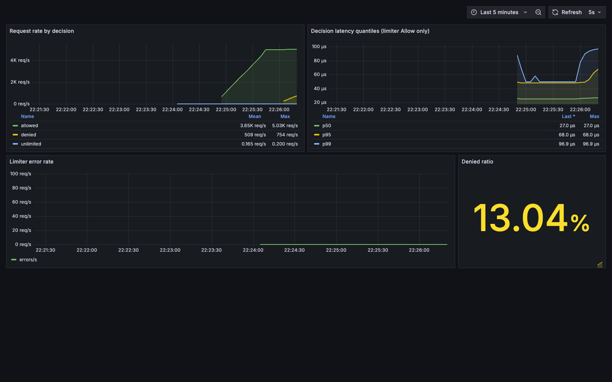

# Load-test results — Stage 4b

End-to-end latency of the rate-limiter middleware under identical load in three
modes: **off** (no middleware, the floor), **redis** (Redis-authoritative token
bucket, one round-trip per request), **tiered** (local batch lease over the Redis
tier). Plus a CPU profile of the tiered mode proving Redis is off the per-request
path.

## Environment

| | |
|---|---|
| Machine | Apple M4, 10 cores |
| OS | macOS 26.5 (arm64) |
| Go | go1.25.0 darwin/arm64 |
| Redis | 7.4.9 (image `redis:7`, via docker-compose) |
| vegeta | v12.13.0 (library, `go run`) |

**The load generator, the server under test, and Redis all run on this one
laptop** (alongside unrelated Docker containers). These numbers are for
**relative comparison between modes only** — they are not absolute production
figures. Co-location means the generator and server compete for the same cores,
which inflates tails; the mode-to-mode *deltas* are the signal.

### Port note (this machine)

Host `6379` was already taken by an unrelated project's Redis and `8080` by
another container. To avoid touching anything else, this run used its own Redis
on host port **6380** (`REDIS_PORT=6380`, container still `6379`) and the measured
server on **:18080**. `docker-compose.yml` still defaults to `6379`; on a clean
machine the canonical commands below work unchanged (`docker compose up -d`,
`-addr :8080`, `-redis localhost:6379`).

## Protocol (exact commands)

```sh
# 1. Redis (clean machine: no REDIS_PORT override needed)
REDIS_PORT=6380 docker compose up -d --wait

go build -o loadtest ./cmd/loadtest

# 2. per mode ∈ {off, redis, tiered} — identical flags otherwise
./loadtest -mode <mode> -batch 100 -redis localhost:6380 -addr :18080 -admin :6060 &
go run ./cmd/loadgen -addr localhost:18080 -rate 10000 -duration 30s -warmup 10s -keys 1000 -out results/<mode>
curl -s http://localhost:6060/metrics > results/<mode>-metrics.txt
kill -TERM %1            # graceful shutdown (SIGTERM)

# 3. during the tiered measured window, a concurrent CPU profile
curl -o results/tiered.pprof 'http://localhost:6060/debug/pprof/profile?seconds=15'
go tool pprof -top -nodecount=15 loadtest results/tiered.pprof
```

Load per mode: 10,000 req/s for 30 s measured (300,000 requests) after a 10 s
warm-up (discarded). `X-API-Key` round-robins over `key-0..key-999`. Rate and
capacity are `1e6` so nothing is ever denied — this measures the **allow** path.

## Results

10,000 req/s was fully sustained in **all three** modes (achieved rate =
target = 10,000 req/s, 100.00% success), so the comparison is valid at this rate;
no rate reduction was needed.

| mode | p50 | p95 | p99 | max | success | achieved RPS |
|--------|---------:|---------:|----------:|------------:|--------:|-------------:|
| off    | 34.551µs | 48.491µs | 158.242µs | 24.890542ms | 100.00% | 10000 |
| redis  | 156.002µs | 374.577µs | 1.283803ms | 43.528084ms | 100.00% | 10000 |
| tiered | 35.06µs  | 49.958µs | 201.215µs | 17.607458ms | 100.00% | 10000 |

(Raw vegeta text/JSON per mode in `results/<mode>.txt` / `results/<mode>.json`.)

### Deltas (p50)

- **redis − off = +121.451µs.** This is the cost the Redis-authoritative limiter
  adds to every request: one network round-trip and Lua token-bucket execution on
  Redis, synchronously in the request path.
- **tiered − off = +0.509µs.** The tiered layer adds essentially nothing at the
  median — the local lease decision (shard lock + integer decrement) is within
  measurement noise of serving no limiter at all.
- **tiered is 4.45× faster than redis at p50** (156.002µs → 35.06µs): the lease
  layer removes ~120µs — about 99.6% of the Redis overhead — from the median
  request. At p99 the gap is 1.283803ms → 201.215µs (~6.4×).

### Where the tiered tail comes from

The internal `decision_duration_seconds` histogram (the limiter call only, not the
full HTTP round-trip; count = 400,000 = warm-up + measured) makes the batching
visible directly:

| decisions ≤ 50µs | redis mode | tiered mode |
|---|---:|---:|
| count (of 400,000) | 0 | 395,998 |
| fraction | 0.0% | 99.0% |

In **redis** mode *no* decision is under 50µs — every one waits on Redis. In
**tiered** mode 99.0% are under 50µs (served from the local lease), and the
remaining ~1% (≈4,002 requests ≈ 400,000 / batch 100) are exactly the refill
requests that take one Redis round-trip. That ~1% is the whole story of tiered's
slightly higher p99 vs off (201µs vs 158µs). `errors_total = 0` in every mode.

## pprof — tiered hot path

`go tool pprof -top -nodecount=15 loadtest results/tiered.pprof` (15.11 s window,
3270 ms samples = 21.64% CPU — the trivial handler leaves the box mostly idle):

```
      flat  flat%   sum%        cum   cum%
         0     0%     0%     1580ms 48.32%  runtime.findRunnable
    1300ms 39.76% 39.76%     1300ms 39.76%  runtime.kevent
         0     0% 39.76%     1210ms 37.00%  runtime.netpoll
         0     0% 39.76%      940ms 28.75%  net/http.(*conn).serve
     900ms 27.52% 67.28%      900ms 27.52%  syscall.syscall
     740ms 22.63% 89.91%      740ms 22.63%  runtime.pthread_cond_signal
```

The profile is **entirely** Go scheduler (`findRunnable`/`schedule`), the kqueue
netpoller (`runtime.kevent`), and the **HTTP server's own** socket I/O to the
vegeta client (`net/http.(*conn).serve`, `net.(*conn).Read`/`Write`,
`syscall.syscall`).

**No `go-redis`, `EVALSHA`, `RedisLimiter.AllowN`, `TieredLimiter`, or
`prometheus` frame appears anywhere in the profile** (grep over all 46 nodes:
none). Two independent facts follow:

1. Redis / network-to-Redis frames are **not** on the per-request path. The only
   network in the profile is the inbound HTTP being served. Redis is touched only
   on batch refill — ~4,000 calls across the whole run — too few to register above
   pprof's sampling floor.
2. The tiered allow path itself (FNV shard hash + mutex + map decrement) is so
   cheap it does not surface as its own node either. It costs ~0.5µs at the median
   (see the delta above), consistent with being invisible to a 100 Hz CPU profile.

This is the property the tiered layer exists for, shown directly: **at steady
state the request path never talks to Redis.**

## Anything surprising (flagged, not hidden)

- **`max` is noisy.** off 24.9ms, tiered 17.6ms, redis 43.5ms — single worst
  samples, orders of magnitude above the respective p99s. On a shared laptop with
  the generator, server, Redis, and other containers all resident, these are OS
  scheduling / GC / netpoll stalls, not limiter cost. `max` should be read as "one
  unlucky request," not a mode property.
- **tiered p99 (201µs) sits above off p99 (158µs).** Not noise — it is the ~1% of
  requests that trigger a batch refill and pay one Redis round-trip, exactly as
  the histogram shows. Expected and consistent.
- **CPU utilisation is only ~22%** during the tiered profile: at 10k trivial
  requests the machine is far from saturated, so latency here reflects per-request
  overhead, not queuing. A saturation test (higher rate until success < 100%) is a
  separate exercise.
- **`requests_total{unlimited} = 1`** in redis and tiered snapshots: the one
  readiness probe (`curl /` with no `X-API-Key`) correctly took the unlimited
  bypass. Everything else is `{allowed}`.

## Needs a human decision

- **Ports on shared machines.** This run used `REDIS_PORT=6380` and `-addr :18080`
  because 6379/8080 were occupied. `docker-compose.yml` defaults to 6379. If you
  want the harness to auto-pick free ports instead of documenting overrides, that
  is a small follow-up.
- **`results/` artifacts.** The `.txt`/`.json`/`.pprof`/`-metrics.txt` files are
  generated outputs currently sitting untracked in `results/`. Decide whether to
  commit them (reproducible record) or add `results/` to `.gitignore`.

---

# Grafana dashboard — Stage 4c

Prometheus + Grafana over the middleware's `/metrics`, fully provisioned (no
click-ops), captured under live load.



The screenshot (`results/grafana.png`) was taken while the load below was
running, ~20 s into the denial burst. At a glance: **allowed** steady at ~5K
req/s; the yellow **denied** line ramping inside the burst window (509 mean /
754 max req/s over the `[1m]` rate window); a flat **unlimited** series at 0.2
req/s (the compose healthcheck probes `GET /` without `X-API-Key` every 5 s —
deliberate, it keeps the third decision value visible); limiter decision
quantiles p50 = 27 µs, p95 = 68 µs, p99 = 96.9 µs (tiered local path,
sub-100 µs); **error rate flat 0**; **denied ratio 13.04%** (stat past its 5%
yellow threshold).

## Stack (all pinned, one command)

| service | image | role |
|---|---|---|
| redis | `redis:7.4` | token-bucket store |
| loadtest | built from `cmd/loadtest/Dockerfile` (`golang:1.25-alpine` → `alpine:3.20`, static) | server under test, `-mode tiered -batch 100 -rate 50 -capacity 500` |
| prometheus | `prom/prometheus:v3.5.0` | scrapes `loadtest:6060` every 5 s (`monitoring/prometheus.yml`) |
| grafana | `grafana/grafana:11.6.0` | provisioned datasource + dashboard, anonymous Viewer |

Provisioning: `monitoring/grafana/provisioning/datasources/datasource.yml` pins
the Prometheus datasource with `uid: prometheus`;
`.../dashboards/provider.yml` file-provider loads
`monitoring/grafana/dashboards/ratelimiter.json` (dashboard uid `ratelimiter`)
at startup. The dashboard is live at
`http://localhost:3000/d/ratelimiter` immediately after `up`.

## Panels and their PromQL

| panel | query |
|---|---|
| Request rate by decision (timeseries) | `sum by (decision) (rate(ratelimiter_middleware_requests_total[1m]))` |
| Decision latency quantiles (timeseries) | `histogram_quantile(0.50\|0.95\|0.99, sum by (le) (rate(ratelimiter_middleware_decision_duration_seconds_bucket[5m])))` |
| Limiter error rate (timeseries) | `rate(ratelimiter_middleware_errors_total[1m])` |
| Denied ratio (stat) | `sum(rate(ratelimiter_middleware_requests_total{decision="denied"}[1m])) / sum(rate(ratelimiter_middleware_requests_total[1m]))` |

Metric names were verified against `metrics.go` (namespace `ratelimiter`,
subsystem `middleware`) and the live 4b scrape snapshots before writing any
query.

## Reproduce

```sh
# clean machine (canonical ports)
docker compose up -d --wait
# this machine: 6379/8080 are taken by other projects
REDIS_PORT=6380 LOADTEST_PORT=18080 docker compose up -d --wait

# confirm the scrape target is up
curl -s http://localhost:9090/api/v1/targets | jq '.data.activeTargets[] | {job: .labels.job, health, lastError}'

# load: 120 s mostly-allowed baseline + a 30 s single-key burst to induce denials
go run ./cmd/loadgen -addr localhost:18080 -rate 5000 -duration 120s -warmup 10s -keys 1000 -out results/grafana-main
# ~70 s in, from a second shell:
go run ./cmd/loadgen -addr localhost:18080 -rate 2000 -duration 30s -warmup 0 -keys 1 -out results/grafana-burst

# screenshot while load runs: open http://localhost:3000/d/ratelimiter?kiosk&from=now-5m&to=now
# (no login needed — anonymous Viewer). This run captured it headlessly with
# Playwright at 1600x1000. No Grafana image-renderer service is included.

docker compose down
```

Note for the stage-4b latency protocol: the compose file now defines the whole
stack, so to start only Redis use `docker compose up -d --wait redis`.

## Measured outputs of this run

Prometheus target (step 2 of the protocol):

```json
{ "job": "loadtest", "instance": "loadtest:6060", "health": "up", "lastError": "" }
```

`docker compose up -d --wait` brought all four services to `healthy`
(`docker compose ps`: grafana/loadtest/prometheus/redis all `Up (healthy)`).

Main run (5000 rps × 120 s over 1000 keys, per-key bucket rate 50/s cap 500 —
steady 5 rps/key, comfortably allowed):

```
target-rate   5000 req/s   achieved-rate 5000 req/s   requests 600000
success       99.98%       p50 120.71µs   p95 298.591µs   p99 9.777656ms
errors        [429 Too Many Requests]
```

Burst run (2000 rps × 30 s, all on one key — this is how denials were induced:
one key's bucket holds 500 + 50/s refill, so ~1944 of 60 000 got through and the
rest were denied):

```
target-rate   2000 req/s   achieved-rate 2000 req/s   requests 60000
success       3.24%        errors [429 Too Many Requests]
```

The main run's 0.02% failures are its own `key-0` requests caught inside the
burst window — collateral of sharing that key's bucket, expected.

**Do not compare these latencies with the stage-4b table.** There the server ran
natively on the host; here it runs inside the Docker Desktop VM, so every
request crosses the host→VM network boundary (p50 120 µs vs 35 µs native, and a
1.2 s max outlier during the run). The 4b table isolates limiter cost; this run
exists to light up the dashboard. The *internal* decision histogram agrees with
4b regardless: p50 27 µs / p99 96.9 µs on the Grafana latency panel — the
limiter itself is as fast as before; only the transport around it changed.

## Files added in this stage

- `docker-compose.yml` — extended: prometheus, grafana, loadtest-as-a-service
  (tiered), all images pinned, healthchecks so `--wait` gates on healthy.
- `cmd/loadtest/Dockerfile` — multi-stage, `CGO_ENABLED=0` static binary;
  final stage `alpine:3.20` (not scratch) so busybox `wget` can serve as the
  container healthcheck.
- `.dockerignore` — keeps `results/`, `monitoring/`, `.git` out of the build
  context (stable layer cache).
- `monitoring/prometheus.yml` — 5 s scrape of `loadtest:6060`.
- `monitoring/grafana/provisioning/...` — datasource + dashboard provider.
- `monitoring/grafana/dashboards/ratelimiter.json` — the four panels above.
- `results/grafana.png` — the live capture.
